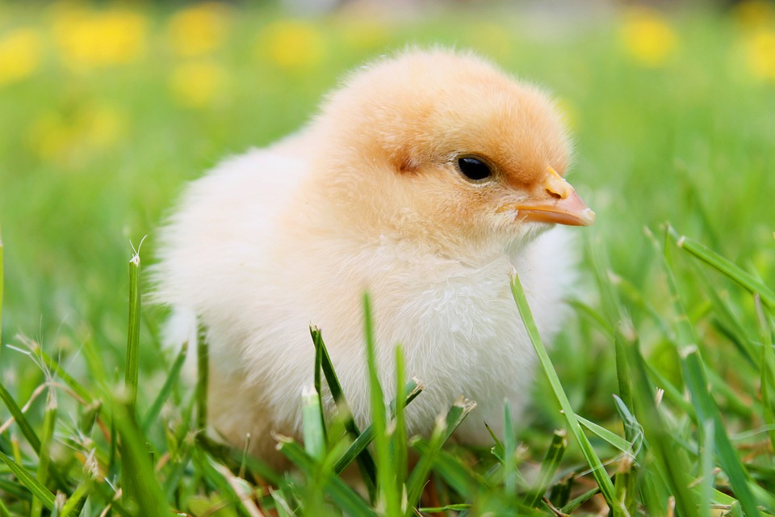

Welcome to my GitHub repo! :smile:

Here I will *commit*, _pull_ and *push* plaintext documents and `code` online or from RStudio.

Here is a picture of a chick. It is by [Philipp Kleindienst](https://pixabay.com/en/chicks-spring-chicken-plumage-349035/).



## A new section

I just wrote *this* in RStudio!

## Another new section created on GitHub

I will need to **pull** this!

## Evaluated R code

The `chickwts` dataset in R has `r nrow(chickwts)` rows.

```{r chickplot}
plot(chickwts$weight ~ chickwts$feed,
     xlab = 'Feed type',
     ylab = 'Weight (grams)',
     col = 2:7)
```
